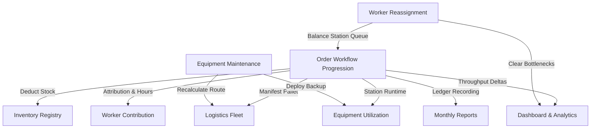

# MUTHU — Smart Operations Partner

<div align="center">
  
  <h2>AI-Powered Warehouse & Logistics Operations Platform</h2>
  <p><em>Real-Time Workflow Orchestration • Predictive Inventory • Prescriptive AI Triage • Workforce Velocity • Hardware Health • Financial Impact Auditing</em></p>
</div>

---

## 📑 Table of Contents

1. [Executive Overview & Philosophy](#1-executive-overview--philosophy)
2. [Quick Start & Local Setup](#2-quick-start--local-setup)
3. [System Architecture & Reactive State Model](#3-system-architecture--reactive-state-model)
4. [Exhaustive Feature Guide](#4-exhaustive-feature-guide)
   - [4.1 Dashboard](#41-dashboard)
   - [4.2 Orders Management & Nested Pipeline](#42-orders-management--nested-pipeline)
   - [4.3 Inventory Management & Predictive Stocking](#43-inventory-management--predictive-stocking)
   - [4.4 Logistics & Active Fleet Tracker](#44-logistics--active-fleet-tracker)
   - [4.5 Workers & Workforce Management](#45-workers--workforce-management)
   - [4.6 Equipment & Machinery Maintenance](#46-equipment--machinery-maintenance)
   - [4.7 Simulation Center & What-If Sandbox](#47-simulation-center--what-if-sandbox)
   - [4.8 Analytics & Operational Intelligence](#48-analytics--operational-intelligence)
   - [4.9 Monthly Operations & Profitability Reports](#49-monthly-operations--profitability-reports)
   - [4.10 Meet Muthu — Strategic Decision Workspace](#410-meet-muthu--strategic-decision-workspace)
   - [4.11 Help Center & Troubleshooting Knowledge Base](#411-help-center--troubleshooting-knowledge-base)
   - [4.12 Settings & Warehouse Configuration](#412-settings--warehouse-configuration)
5. [End-to-End Workflow Engine & Live Simulation](#5-end-to-end-workflow-engine--live-simulation)
6. [Interactive Modals & Guided Tools](#6-interactive-modals--guided-tools)
7. [Cross-Module Data Consistency & Synchronization](#7-cross-module-data-consistency--synchronization)
8. [Project File Structure & Component Map](#8-project-file-structure--component-map)
9. [Tech Stack & Design Tokens](#9-tech-stack--design-tokens)

---

## 1. Executive Overview & Philosophy

**MUTHU** is a next-generation warehouse management system (WMS) and supply chain orchestration platform designed for modern enterprise fulfillment hubs. Built around an explainable AI core, MUTHU connects floor operations, logistics corridors, personnel velocity, and machinery health into a single unified telemetry system.

The platform is structured to answer four fundamental business questions at any second of operations:
1. **WHAT is happening?** — Live order pipelines, active truck routes, machine utilization, and floor staffing.
2. **WHY is it happening?** — Root-cause diagnostics, packing station bottlenecks, inventory shortages, and service intervals.
3. **WHAT should the manager do?** — Prescriptive, high-confidence AI recommendations with explicit action buttons.
4. **WHAT is the BUSINESS IMPACT?** — Quantified financial value, estimated revenue supported, delay cost avoidance, and SLA compliance improvements.

---

## 2. Quick Start & Local Setup

### Prerequisites
- **Node.js**: v18.0.0 or higher
- **npm**: v9.0.0 or higher

### Installation & Run Steps
```bash
# 1. Clone or navigate to the repository
cd e:/muthu

# 2. Install dependencies
npm install

# 3. Start development server (with hot reload on port 3000)
npm run dev

# 4. Compile TypeScript verification (zero type errors)
npm run lint

# 5. Build optimized production bundle
npm run build
```

The application will be live at: **`http://localhost:3000`**

---

## 3. System Architecture & Reactive State Model

MUTHU is architected with a single centralized state layer in [`src/App.tsx`](file:///e:/muthu/src/App.tsx) connecting all operational domains. A change in one module instantaneously cascades across every related screen:



---

## 4. Exhaustive Feature Guide

### 4.1 Dashboard
- **File:** [`src/components/DashboardView.tsx`](file:///e:/muthu/src/components/DashboardView.tsx)
- **Facility Health Score:** Live 0–100 composite index calculated from SLA compliance, picker velocity, inventory sufficiency, and equipment uptime.
- **Bento Telemetry Cards:**
  - *Active Orders Queue*: Total orders in flight with daily dispatch counters.
  - *Critical Decisions Pending*: Triage alerts requiring manager sign-off.
  - *SLA At-Risk Orders*: Real-time countdown tracking with direct jump to audit modals.
  - *Inventory Safety Buffer*: Critical SKU tracking with one-click restock triggers.
- **Hourly Productivity Index:** Interactive velocity charts benchmarking actual picks/hour against facility targets.
- **Live Event Telemetry Stream:** Chronological event feed recording every pick, pack, QC check, truck departure, and stock deduction.

---

### 4.2 Orders Management & Nested Pipeline
- **File:** [`src/components/OrdersView.tsx`](file:///e:/muthu/src/components/OrdersView.tsx) & [`src/ordersData.ts`](file:///e:/muthu/src/ordersData.ts)
- **Nested Expandable Navigation:**
  Sidebar submenu under Orders displays live counts calculated directly from active mock records:
  - `All Orders` (125)
  - `Received` (16) — New, Priority Assigned, Inventory Checked, Stock Allocated
  - `Picking` (11) — Active tote picking in progress
  - `Packing` (9) — Packing station box assembly and bubble sealing
  - `Quality Check` (6) — Barcode scan and optical verification
  - `Ready for Dispatch` (8) — Staged in outbound dock bays
  - `Dispatched` (22) — Carrier manifest signed and loaded
  - `On the Way` (18) — En route on highway logistics corridors
  - `Delivered` (49) — Customer delivery confirmed
- **Segment Switcher:**
  - *All Orders*: Complete warehouse registry.
  - *Business (B2B)*: Wholesale consignments, PO numbers, bulk pallet bays, enterprise contracts, and multi-shipment splitters.
  - *Individual (B2C)*: Direct consumer parcels, express couriers, same-day delivery windows, and payment statuses.
  - *VIP & Urgent*: High-priority enterprise hospital shipments and expedited consumer lines.
  - *SLA At Risk*: Orders with less than 120 minutes before cutoff.
- **Explainable Priority Calculation Engine:**
  - Automatic priority scoring (`Critical`, `Urgent`, `High`, `Normal`, `Low`) based on customer tier, shipping method, and remaining SLA minutes.
- **Collapsible Muthu Recommendations Panel:**
  - **Zero-Clipping Design**: Controlled width (`w-full xl:w-[410px]`) with natural text wrapping and internal vertical scrolling (`scrollbar-thin`).
  - **Expand/Collapse Toggle**: Collapse into a compact floating `[🤎 Muthu Decisions]` badge, expanding the orders grid to use 100% screen width.
  - **Muthu Decision Format**:
    1. *Problem*: Exact root cause (e.g. 8 orders at risk; Packing Station 2 overloaded at 132%).
    2. *Reason*: Data evidence (e.g. queue congestion behind 2 hospital orders).
    3. *Business Impact*: Quantified risk (e.g. potential 21-minute dispatch delay).
    4. *Recommendation*: Prescriptive action (e.g. move 2 available packers from Zone B).
    5. *Confidence*: Statistical probability (e.g. 96%).
    6. *Expected Result*: Measurable outcome (e.g. reduce SLA risk from 8 orders to 2).
    7. *Actions*: Interactive `[Approve]` and `[Dismiss]` buttons.
- **Order Details & 15-Stage Workflow Drawer:**
  - Complete manifest items, bin locations, carrier tracking, and interactive step-by-step pipeline progression.

---

### 4.3 Inventory Management & Predictive Stocking
- **File:** [`src/components/InventoryView.tsx`](file:///e:/muthu/src/components/InventoryView.tsx) & [`src/inventoryData.ts`](file:///e:/muthu/src/inventoryData.ts)
- **SKU Health Matrix:** Quantity available, reserved quantities, damaged stock, reorder levels, and max stock thresholds.
- **AI Stock Predictions:**
  - Categorized into *Stable Demand*, *Rapid Depletion Alert*, *Restock Recommended*, *Overstock Risk*, and *Dead Stock*.
- **Restock Actions:** One-click quick-restock modal with supplier lead-time estimations.
- **Warehouse Zone Bin Tracking:** Exact aisle, rack, shelf, and bin coordinates across Zone A (Furniture), Zone B (Electronics), Zone C (Packaging), Zone D (Accessories), and Mezzanine.

---

### 4.4 Logistics & Active Fleet Tracker
- **File:** [`src/components/LogisticsView.tsx`](file:///e:/muthu/src/components/LogisticsView.tsx) & [`src/logisticsData.ts`](file:///e:/muthu/src/logisticsData.ts)
- **Fleet Route Lifecycle:**
  - `Assigned` → `Loading` → `Fully Packed` → `Ready to Depart` → `Departed` → `En Route` → `Near Destination` → `Delivered` → `Returning` → `Returned`.
- **Truck Telemetry:** Vehicle numbers, drivers, capacity in tons/pallets, current load %, fuel %, temperature (°C for cold-chain consignments), ETA, and route distance.
- **Arterial Highway Corridors:** Real-time tracking along NH44 (Hyderabad–Bangalore), NH65 (Hyderabad–Vijayawada), and Chennai logistics corridors with weather/toll delay risk triage.

---

### 4.5 Workers & Workforce Management
- **Files:** [`src/components/WorkersView.tsx`](file:///e:/muthu/src/components/WorkersView.tsx) & [`src/workersData.ts`](file:///e:/muthu/src/workersData.ts)
- **32 Realistic Personnel Roster:**
  Covering all 9 warehouse roles:
  1. *Picker* (e.g. Asha Reddy, Lakshmi Narayana, Deepak Chawla)
  2. *Packer* (e.g. Ravi Kumar, Ananya Patel, Arjun Das)
  3. *Quality Inspector* (e.g. Vikram Singh, Kavita Sengupta)
  4. *Warehouse Associate* (e.g. Sunita Rao, Radhika Deshmukh)
  5. *Loader* (e.g. Suresh Babu, Manoj Joshi, Harish Venkat)
  6. *Dispatcher* (e.g. Priya Sharma, Pooja Nair)
  7. *Driver* (e.g. Rajesh Varma, Ganesh Pillai, Nithin George)
  8. *Supervisor* (e.g. Meena Iyer, Karthik Swaminathan)
  9. *Maintenance Technician* (e.g. Kiran Naik, Sandeep Mukherjee)
- **Worker Metrics:**
  - Worker ID, Name, Role, Shift (*Morning, Afternoon, Night*), Zone, Availability (*Available, On Shift, Overloaded, On Break, On Leave*).
  - Orders Handled, Packages Picked, Packages Packed, QC Checks, Avg Processing Time (mins), Productivity Score (0–100), Attendance %, Current Workload %, SLA Contribution %.
  - Performance Statuses: `EXCELLENT`, `GOOD`, `ON TRACK`, `NEEDS IMPROVEMENT`, `UNDER REVIEW`.
- **Estimated Revenue Supported:**
  - Clearly labeled calculation attributing the value of fulfilled shipments and SLA milestones supported by each worker.
- **Performance Recognition Matrix:**
  - *🏆 Top Performer*: Ravi Kumar (98% SLA, 18% above team speed), Vikram Singh (194 inspections, 0 defect escapes), Meena Iyer (480 orders, 0 breaches).
  - *⚡ High Impact*: Priya Sharma (gate pass velocity), Rajesh Varma (100% on-time arterial runs), Karthik Swaminathan (dock surge coordination).
  - *📈 Most Improved*: Sunita Rao (+15% multi-skilled gain), Sandeep Mukherjee (-24% breakdown downtime), Madhuri Bhosale (+22% packing speed).
  - *📚 Needs Training*: Asha Reddy (picking accuracy refresher: 91% vs 96% team benchmark).
  - *📋 Performance Review Required*: Harish Venkat (loading velocity lag with assigned 2-week mentor), Ananya Patel (station 2 overload rebalancing).
- **Bonus Recommendations:**
  - Algorithmically nominated bonuses (e.g. ₹5,000 for Ravi Kumar, ₹6,500 for Vikram Singh, ₹8,000 for Meena Iyer) with performance evidence and manager approval buttons.
- **Monthly Workforce Report:**
  - Historical tab with month selector (*February 2026, January 2026, December 2025, November 2025*) displaying shifts, attendance %, throughput, and overtime hours.

---

### 4.6 Equipment & Machinery Maintenance
- **Files:** [`src/components/EquipmentView.tsx`](file:///e:/muthu/src/components/EquipmentView.tsx) & [`src/equipmentData.ts`](file:///e:/muthu/src/equipmentData.ts)
- **Machinery Fleet Coverage:**
  - *Electric Forklifts* (FL-07, FL-03 Standby, FL-01 High-Bay)
  - *Heavy Overhead Cranes* (CR-01, CR-02 Gantry)
  - *Hydraulic Pallet Jacks* (PJ-01, PJ-02, PJ-04)
  - *Conveyor Sortation Systems* (CV-02 Main, CV-01 Inbound Feeder)
  - *Automated High-Speed Sorters* (AS-01 Mezzanine)
  - *Industrial & Handheld Barcode Scanners* (BS-04 Array, BS-02 Bluetooth)
  - *Automatic Box Sealing Machines* (PM-02, PM-01)
  - *Hydraulic Dock Levelers* (LE-01, LE-02)
  - *Autonomous AGV Robots* (RB-01, RB-02 Standby)
- **Health Statuses:** `OPERATIONAL`, `MAINTENANCE DUE`, `UNDER MAINTENANCE`, `WARNING`, `OUT OF SERVICE`, `CRITICAL`.
- **Muthu Observes Maintenance Engine:**
  - Automatic detection when machinery exceeds recommended service hours (e.g. Forklift FL-07 exceeding 250-hour hydraulic service interval).
  - Standby backup assignment: Deploying Standby Forklift FL-03 to Outbound Bay 04 while FL-07 is scheduled for Night Shift servicing.
- **Interactive Controls:** `[Schedule Maintenance]`, `[Assign Backup]`, `[Mark Maintenance Complete]`, and machine inspection drawers.

---

### 4.7 Simulation Center & What-If Sandbox
- **File:** [`src/components/SimulationView.tsx`](file:///e:/muthu/src/components/SimulationView.tsx) & [`src/simulationEngine.ts`](file:///e:/muthu/src/simulationEngine.ts)
- **Scenario Presets:**
  - *VIP Medical Surge*: +120 express orders, stockout stress testing.
  - *Flash Sale Spike*: +350 consumer parcels, picking congestion.
  - *B2B Wholesale Wave*: +45 heavy freight pallets, dock queue delays.
  - *Severe Weather Disruption*: Highway fog causing courier arrival delays.
  - *Equipment Breakdown*: Box sealer maintenance outage.
- **Interactive Parameter Sliders:**
  - Additional orders, order mix, picker delta, packer delta, zone congestion %, blocked shelves, QC delay mins, courier delay mins, stockout severity.
- **Telemetry Comparison (Before vs Simulated vs Optimized):**
  - Health Score, Order Completion Rate, SLA Compliance %, Worker Utilization %, Picking/Packing Times, Revenue at Risk (INR).
- **Zone Load Heatmap & Worker Allocation Charts.**

---

### 4.8 Analytics & Operational Intelligence
- **File:** [`src/components/AnalyticsView.tsx`](file:///e:/muthu/src/components/AnalyticsView.tsx) & [`src/analyticsData.ts`](file:///e:/muthu/src/analyticsData.ts)
- **Throughput & Velocity Curves:** Hourly order completion trends vs baseline.
- **Zone Efficiency Heatmap:** Zone A, B, C, D, Mezzanine, and Dock Bay pick density.
- **Courier & Carrier SLA Reliability:** On-time performance benchmarks for BlueDart, Delhivery, FedEx, and internal fleet.
- **Financial Projections:** Clear distinction between realized order values, projected revenue supported, and delay cost avoidance.

---

### 4.9 Monthly Operations & Profitability Reports
- **Files:** [`src/components/ReportsView.tsx`](file:///e:/muthu/src/components/ReportsView.tsx) & [`src/reportsData.ts`](file:///e:/muthu/src/reportsData.ts)
- **Muthu's Monthly Operations Summary (Top Executive Card):**
  - Full narrative synthesis of facility performance.
  - *7 Core Highlights*:
    1. 🏆 **Top Achievement**: Zero SLA breaches on high-priority hospital contracts across 480 shipments.
    2. ⚠️ **Biggest Risk**: Packing Station 2 conveyor congestion during 2 PM–6 PM shift.
    3. ⚙️ **Primary Bottleneck**: Packing Bench 2 Box Sealing Machine PM-02 maintenance outage.
    4. 👤 **Top Performer**: Ravi Kumar (98% SLA Contribution, 186 packages packed).
    5. 🔧 **Equipment Risk**: Forklift FL-07 (Hydraulic service due in 3 days, 88% load).
    6. 📦 **Inventory Risk**: Medical Sterile Packaging buffer at 14% safety threshold.
    7. 💡 **Muthu's Top Recommendation**: Reallocate 2 packers from Zone B to Packing Station 2 between 2 PM–6 PM to reduce delays by 14%.
- **6-Pillar Operational Ledger:**
  1. *ORDERS*: Received (1,842), Picked (1,810), Packed (1,780), Dispatched (1,740), Delivered (1,680), Delayed/Cancelled (8/12).
  2. *LOGISTICS*: Trucks Dispatched (72), Delivered (68), Returning (4), Avg Dispatch Time (18.5m), Avg Delivery Time (4.2h), Delayed Shipments (2).
  3. *WORKFORCE*: Workers Active (32), Packages Picked (4,120), Packages Packed (3,980), Avg Productivity (92.4), SLA Contribution (96.8%), Attendance (95.8%).
  4. *INVENTORY*: Units Processed (18,500), Low Stock Events (17), Out-of-Stock (2), Damaged Items (14), Supplier Reorders (12).
  5. *EQUIPMENT*: Machines Deployed (18), Maintenance Events (3), Downtime Hours (6.5h), Backup Equipment Usage (18.0h).
  6. *BUSINESS IMPACT*: Order Value Fulfilled (₹1.48 Cr), Estimated Revenue Supported (₹1.62 Cr), Estimated Delay Cost (₹32,000), Projected Improvement (+14.0%).
- **Interactive Month Selector:** Tab switching across *February 2026 (Current Month)*, *January 2026*, and *December 2025* with PDF/CSV export actions.

---

### 4.10 Meet Muthu — Strategic Decision Workspace
- **File:** [`src/components/DecisionWorkspaceView.tsx`](file:///e:/muthu/src/components/DecisionWorkspaceView.tsx)
- **Prescriptive Strategy Sandbox:**
  - Multi-agent scenario analysis with interactive decision prompts.
  - Predicted throughput gains, clearance times, and SLA assessment before committing policy changes.

---

### 4.11 Help Center & Troubleshooting Knowledge Base
- **File:** [`src/components/HelpCenterView.tsx`](file:///e:/muthu/src/components/HelpCenterView.tsx) & [`src/helpData.ts`](file:///e:/muthu/src/helpData.ts)
- **Categorized FAQs:** Getting Started, Orders, Inventory, Logistics, Simulation, Analytics, Muthu AI, Troubleshooting.
- **Actionable Troubleshooting Runbooks:** Problem statement, root-cause diagnosis, and step-by-step resolution workflows.
- **Guided Product Tour Trigger:** Launch interactive product tour walkthrough.

---

### 4.12 Settings & Warehouse Configuration
- **File:** [`src/components/SettingsModal.tsx`](file:///e:/muthu/src/components/SettingsModal.tsx)
- Facility name, operational shift hours, auto-dispatch triggers, SLA risk alert thresholds (minutes), and notification preferences.

---

## 5. End-to-End Workflow Engine & Live Simulation

MUTHU incorporates an execution engine modeled on real-world warehouse conveyor and staging physics:

- **15 Canonical Fulfillment Stages:**
  1. `Order Created`
  2. `Priority Determined`
  3. `Inventory Checked`
  4. `Inventory Reserved`
  5. `Inventory Allocated`
  6. `Picker Assigned`
  7. `Active Picking`
  8. `Packing & Box Assembly`
  9. `Quality Check & Scan`
  10. `Ready for Dispatch`
  11. `Dispatched & Gate Pass`
  12. `En Route Delivery`
  13. `Delivered to Customer`
  14. `Inventory Deducted & Rebalanced`
  15. `Telemetry & Ledger Updated`

- **Quality Check Exception Loop:**
  - Ability to trigger an inline defect inspection exception (`Issue Detected` → `Incident Ticket Created` → `Replacement Allocated` → `Repack` → `Repeat QC` → `Dispatch`).
- **Live Background Auto-Drive:**
  - Background simulation timer continuously advancing random orders through the pipeline with configurable speed multipliers (1x, 2x, 5x, 10x).

---

## 6. Interactive Modals & Guided Tools

1. **Guided Product Tour Modal ([`ProductTourModal.tsx`](file:///e:/muthu/src/components/ProductTourModal.tsx)):** Step-by-step guided onboarding tour navigating through Dashboard, Orders, Inventory, Logistics, Workers, Equipment, Simulation, and Reports.
2. **SLA Risk Detailed Audit Modal ([`SlaRiskModal.tsx`](file:///e:/muthu/src/components/SlaRiskModal.tsx)):** Deep-dive inspection into the 8 orders at immediate SLA risk with one-click Muthu triage approval.
3. **Critical SKUs Inventory Modal ([`CriticalSkusModal.tsx`](file:///e:/muthu/src/components/CriticalSkusModal.tsx)):** Instant view of all SKUs below minimum buffer stock with quick restock actions.
4. **Workflow Timeline Modal ([`WorkflowTimelineModal.tsx`](file:///e:/muthu/src/components/WorkflowTimelineModal.tsx)):** Visual stage-by-stage progression inspector with time estimates and assigned worker tags.
5. **New Report Export Modal ([`NewReportModal.tsx`](file:///e:/muthu/src/components/NewReportModal.tsx)):** Custom PDF, CSV, and Excel report generator.
6. **Demo Mode Showcase Modal ([`DemoModeModal.tsx`](file:///e:/muthu/src/components/DemoModeModal.tsx)):** Interactive live demonstration scenarios (VIP Surge, Low Stock, Bottleneck Resolution).

---

## 7. Cross-Module Data Consistency & Synchronization

All state mutations in MUTHU strictly adhere to cross-module synchronization:

| Action Initiated | Synchronized Module Effects |
| :--- | :--- |
| **Order Dispatched** | Order status advances to `Dispatched`; stock deducted in `Inventory`; assigned truck status changes to `En Route`; worker `ordersHandled` & `estimatedRevenueSupported` increase; `Dashboard` dispatches count increments; `Monthly Report` ledger updates. |
| **QC Issue Flagged** | Order routed to `Quality Check Exception Loop`; reserve inventory allocated; incident logged in `Telemetry Stream`. |
| **Equipment Servicing Scheduled** | Equipment status set to `UNDER MAINTENANCE`; standby backup machine (e.g. `FL-03`) activated to `OPERATIONAL`; dock capacity protected. |
| **Worker Reassigned** | Worker station updated (e.g. to `Packing Station 2`); station queue clearance rate increases; Muthu risk score recalculates. |
| **Stock Restocked** | SKU available quantity updates; stock health % recalculated; AI prediction updates from *Restock Needed* to *Stable*. |

---

## 8. Project File Structure & Component Map

```
e:/muthu/
├── src/
│   ├── App.tsx                      # Root component, global state, router & modal manager
│   ├── types.ts                     # TypeScript type definitions (Workers, Equipment, Orders, Reports)
│   ├── index.css                    # Design tokens, custom scrollbars, pastel animations
│   ├── mockData.ts                  # Shared initial constants, mascot URLs, warehouse stats
│   ├── ordersData.ts                # Mock order records, priority engine, Muthu recommendations
│   ├── workersData.ts               # 32 Indian worker records, recognition matrix, monthly workforce data
│   ├── equipmentData.ts             # Machinery fleet records, backup links, maintenance intervals
│   ├── reportsData.ts               # Historical monthly operations reports (6 pillars + Muthu summary)
│   ├── inventoryData.ts             # SKU registry, stock calculations, predictive demand
│   ├── logisticsData.ts             # Truck shipments, arterial highway corridors, fleet telemetry
│   ├── simulationEngine.ts          # What-if calculation sandbox & stress test models
│   ├── workflowEngine.ts            # 15-stage canonical WMS fulfillment workflow engine
│   ├── helpData.ts                  # FAQs, troubleshooting guides, onboarding tour scripts
│   │
│   └── components/
│       ├── SideNavBar.tsx           # 12-section collapsible sidebar with nested Orders submenu
│       ├── TopNavBar.tsx            # Global search, segment filter, assistant & profile bar
│       ├── DashboardView.tsx        # Bento KPIs, health score, hourly curves, telemetry log
│       ├── OrdersView.tsx           # Nested status filter, B2B/B2C tabs, collapsible Muthu panel
│       ├── WorkersView.tsx          # 8 KPIs, Roster grid, Recognition matrix, Bonus approvals, Monthly report
│       ├── EquipmentView.tsx        # Fleet health KPIs, Muthu maintenance alerts, backup links
│       ├── ReportsView.tsx          # Monthly operations report, Muthu summary, 6-pillar breakdown
│       ├── InventoryView.tsx        # SKU table, restock triggers, bin locations
│       ├── LogisticsView.tsx        # Fleet cards, route trackers, capacity & temp monitors
│       ├── SimulationView.tsx       # What-if scenario builder, parameter sliders, metric comparison
│       ├── DecisionWorkspaceView.tsx# Strategic AI Copilot workspace
│       ├── HelpCenterView.tsx       # Searchable knowledge base & troubleshooting guides
│       ├── WorkflowControlBar.tsx   # Global floating workflow engine control widget & auto-drive
│       ├── WorkflowTimeline.tsx     # 15-stage visual stepper component
│       ├── WorkflowTimelineModal.tsx# Order workflow timeline inspection modal
│       ├── ProductTourModal.tsx     # Step-by-step guided onboarding walkthrough
│       ├── SlaRiskModal.tsx         # Deep audit modal for orders at SLA risk
│       ├── CriticalSkusModal.tsx    # Low stock buffer inventory modal
│       ├── NewReportModal.tsx       # PDF/CSV export modal
│       ├── SettingsModal.tsx        # Facility configuration modal
│       ├── SupportModal.tsx         # Support desk contact modal
│       ├── DemoModeModal.tsx        # Hackathon demo showcase modal
│       └── Toast.tsx                # Real-time feedback toast notification system
│
├── index.html                       # HTML entry point with Google Fonts (Plus Jakarta Sans, Roboto Mono)
├── package.json                     # Dependencies, scripts, and build configuration
├── tsconfig.json                    # TypeScript compiler options
├── vite.config.ts                   # Vite bundler configuration
└── README.md                        # Master documentation file
```

---

## 9. Tech Stack & Design Tokens

- **Framework**: React 19.0.1, TypeScript 5.8, Vite 6.4
- **Styling Architecture**: Vanilla CSS tokens + Tailwind CSS 4
- **Typography**: *Plus Jakarta Sans* (Headlines & Body), *Roboto Mono* (Telemetry, IDs, Timers, Currency)
- **Palette**: Warm pastel editorial palette with warm amber accents, soft emerald indicators, slate borders, and high-contrast dark badges.
- **Build Quality**: Verified with 0 TypeScript compilation errors and production-optimized bundle chunks.
